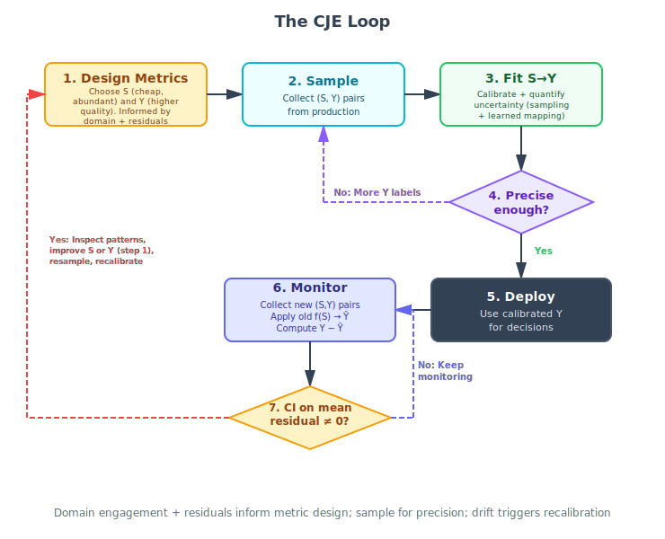

# CJE Playbook: Audits, Drift Response, and Label Budgeting

This is the operational runbook for:
- running transport audits,
- deciding what to do when audits pass vs fail,
- planning oracle label budgets.

It is written against the current CJE API in this repo.

Advanced note: CJE supports IPS/DR variants for counterfactual OPE, but this runbook intentionally focuses on the default Direct-mode operating loop.

---

## Canonical Operational Loop



The recommended loop is:
1. Design metrics (choose/adjust `S` and `Y`)
2. Sample (`S, Y` pairs)
3. Fit `S -> Y` with uncertainty
4. Precision gate: precise enough?
   - No -> collect more `Y` labels, return to Step 2
   - Yes -> deploy
5. Deploy
6. Monitor with new `(S, Y)` and residuals `Y - Y_hat`
7. Drift gate: CI on mean residual excludes 0?
   - No -> keep monitoring (Step 6)
   - Yes -> inspect failure patterns, improve `S`/`Y`, then return to Step 1

Two-loop framing:
- **Inner calibration loop:** Steps 1-4
- **Outer monitoring loop:** Steps 5-7

This playbook’s sections below implement those same steps using CJE APIs.

---

## 1) Baseline Evaluation Run

Run your main analysis with bootstrap inference (default in Direct mode).

```python
from cje import analyze_dataset

results = analyze_dataset(
    fresh_draws_dir="responses/current_batch",
    estimator="direct",
    estimator_config={
        "inference_method": "bootstrap",
        "n_bootstrap": 2000,
        "use_augmented_estimator": True,
        "use_multipolicy_eif": False,  # conservative default
    },
)

print(results.estimates)
print(results.standard_errors)
```

Notes:
- `bootstrap` + `use_augmented_estimator=True` is the production default.
- Keep `use_multipolicy_eif=False` unless you have evidence of shared calibration curves across policies.

---

## 2) Run a Transport Audit (Probe Protocol)

Use a small oracle-labeled probe slice (typically 40-60 rows) on the target policy/group.

```python
import json
from cje.diagnostics import audit_transportability

probe = [json.loads(line) for line in open("probes/policy_gpt4mini.jsonl")]
diag = audit_transportability(
    calibrator=results.calibrator,
    probe_samples=probe,
    group_label="policy:gpt-4-mini",
)

print(diag.summary())
# Transport: PASS/WARN/FAIL | Group: ... | N=... | δ̂: ... | Action: ...
```

### Current Status Rules (Implementation)

The classifier in `cje/diagnostics/transport.py` uses:
- `PASS`: `0` is inside the 95% CI for `δ̂ = E[Y - f(S)]`
- `WARN`: CI excludes 0, and `abs(δ̂) < 0.05`
- `FAIL`: CI excludes 0, and `abs(δ̂) >= 0.05`

---

## 3) Decision Policy After Audit

### PASS

Interpretation:
- No statistically detectable mean bias on the probe group (`0` inside CI).

Action:
- Reuse calibrator for current cycle (equivalent to Step 7 "No drift").
- Keep normal monitoring cadence.
- Optionally merge probe labels into calibration history for the next cycle.

### WARN

Interpretation:
- Detectable but small bias.

Action:
- Increase probe size next cycle.
- Inspect residual structure by decile.
- Consider anchoring updates through pooled recalibration if WARN persists.

### FAIL

Interpretation:
- Clear bias; do not rely on unchanged calibrator for high-stakes decisions.

Action:
- Collect additional target-policy oracle labels (typically 100-200, stratified) and/or improve metric design.
- Re-estimate with transport-aware bootstrap correction.
- If failures persist, refit calibration with richer target-era data and covariates.
- Treat this as Step 7 "drift detected" -> return to Step 1 of the loop.

---

## 4) Incorporate New Audit Data When Audits PASS

When probe results pass, treat probe labels as additional calibration signal for future runs.

Recommended pattern:
1. Append validated probe labels to a maintained calibration dataset.
2. Re-run analysis with pooled oracle sources.

```python
from cje import analyze_dataset

results_next = analyze_dataset(
    fresh_draws_dir="responses/next_batch",
    calibration_data_path="data/oracle_history.jsonl",  # includes prior + passed probes
    combine_oracle_sources=True,
    estimator="direct",
    estimator_config={
        "inference_method": "bootstrap",
        "n_bootstrap": 2000,
        "use_augmented_estimator": True,
    },
)
```

Why this is preferred:
- It preserves data efficiency by pooling all high-quality labels.
- Bootstrap refit captures calibration uncertainty with the expanded label set.

---

## 5) Correct for Failed Audits

### Step A: Expand target oracle slice

- Sample across score/risk deciles, not only difficult prompts.
- Keep labeling random within strata to preserve ignorability.

### Step B: Re-estimate with transport-aware correction

Use `calibration_policy` when calibration was learned on a base policy and you suspect transport drift to targets.

```python
from cje import analyze_dataset

results_corrected = analyze_dataset(
    fresh_draws_dir="responses/current_batch",
    calibration_data_path="data/base_plus_recent_oracle.jsonl",
    combine_oracle_sources=True,
    estimator="direct",
    estimator_config={
        "inference_method": "bootstrap",
        "n_bootstrap": 2000,
        "use_augmented_estimator": True,
        "calibration_policy": "base",  # fit calibrator on base-policy oracle slice
    },
)
```

What this does:
- Fits calibration using the specified base policy oracle subset.
- Uses residual correction terms over oracle labels across policies, which captures transport bias in target policies.

### Step C: Move to richer calibration if FAIL persists

If decile residuals show systematic regional miscalibration:
- increase target-era oracle coverage,
- add covariates likely tied to judge bias,
- allow two-stage calibration via `auto` mode.

```python
results_refit = analyze_dataset(
    fresh_draws_dir="responses/current_batch",
    calibration_data_path="data/recent_target_oracle.jsonl",
    combine_oracle_sources=True,
    include_response_length=True,
    calibration_covariates=["domain", "difficulty"],
    estimator="direct",
    estimator_config={"inference_method": "bootstrap"},
)
```

Important:
- Treat global offset-only correction as a diagnostic baseline, not default production correction.

---

## 6) Label Budgeting (How Many Oracle Labels?)

Budgeting uses the planning model:
- total variance `= sigma2_eval / n + sigma2_cal / m`
- costs `B = c_S * n + c_Y * m`
- optimize with square-root allocation law.

### Pilot-based planning (recommended)

```python
from cje.data.fresh_draws import load_fresh_draws_auto
from cje.diagnostics import CostModel, fit_variance_model, plan_evaluation, plan_for_mde

base_pilot = load_fresh_draws_auto("responses/pilot", "base")

variance_model = fit_variance_model(
    base_pilot,
    n_replicates=150,
    verbose=True,
)

cost = CostModel(surrogate_cost=0.01, oracle_cost=0.16)

# Fixed budget -> achievable sensitivity
plan = plan_evaluation(budget=5000, variance_model=variance_model, cost_model=cost)
print(plan.summary())
print(plan.n_samples, plan.m_oracle, plan.mde)

# Target sensitivity -> required budget
plan_target = plan_for_mde(
    target_mde=0.01,
    variance_model=variance_model,
    cost_model=cost,
)
print(plan_target.total_cost)
```

### No pilot yet: simulation-based planning

```python
from cje.diagnostics import simulate_variance_model, plan_evaluation, CostModel

variance_model = simulate_variance_model(r2=0.7, verbose=True)
cost = CostModel(surrogate_cost=0.01, oracle_cost=0.16)
plan = plan_evaluation(budget=5000, variance_model=variance_model, cost_model=cost)
print(plan.summary())
```

### Label budgeting rules

- Always sample oracle labels randomly (or randomly within strata).
- Use real dollar costs in `CostModel`.
- Refit the variance model periodically with new pilot/production evidence.
- If audit FAIL frequency rises, increase planned `m_oracle` and rerun planning.

---

## 7) Suggested Operational Cadence

Per evaluation cycle:
1. Run `analyze_dataset(...)` with bootstrap inference.
2. Run transport audit on each deployment-relevant target policy.
3. Route by PASS/WARN/FAIL using Section 3.
4. Merge accepted audit labels into calibration history.
5. Re-run planning quarterly (or after judge/oracle regime changes).

---

## 8) Minimal Checklist

- Inference: `inference_method="bootstrap"`, `n_bootstrap=2000`
- Debiasing: `use_augmented_estimator=True`
- Probe size: 40-60 oracle labels per target group
- FAIL response: collect 100-200 additional target labels + transport-aware re-estimation
- Planning: `fit_variance_model` + `plan_evaluation` / `plan_for_mde`
