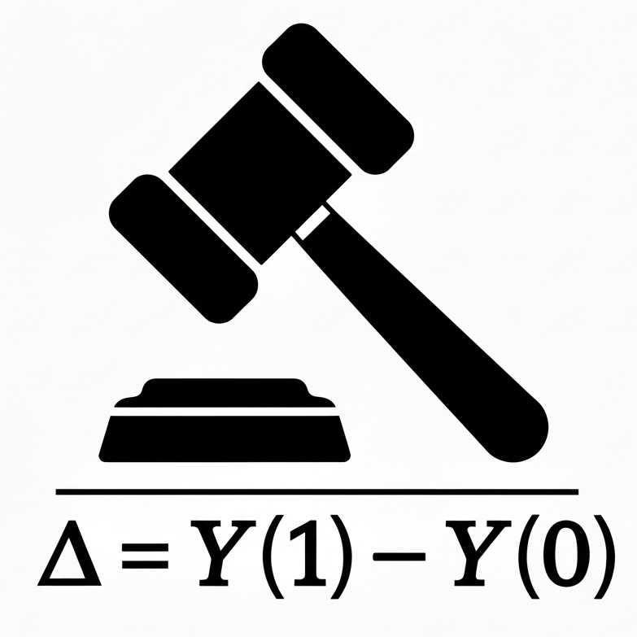

<div align="left">
  
</div>

# CJE - Causal Judge Evaluation

[](https://cimo-labs.com/cje)
[](https://www.python.org/downloads/)
[](https://github.com/cimo-labs/cje/actions)
[](LICENSE)

**What if your AI evals looked like A/B tests with reliable confidence intervals and causal guarantees?**

CJE makes it possible. Get unbiased estimates of how your new model will perform before deployment, with the statistical rigor you'd expect from production experimentation.

## Why CJE?

🎯 **Problem**: Your LLM-judge scores are noisy, biased, and untrustworthy
✅ **Solution**: CJE uses causal inference to debias them, giving you reliable estimates with confidence intervals without compromising on judge flexibility

## Installation

```bash
pip install cje-eval
```

For development:
```bash
git clone https://github.com/fondutech/causal-judge-evaluation.git
cd causal-judge-evaluation
poetry install  # or pip install -e .
```

## Quick Start

```python
from cje import analyze_dataset

# Get unbiased estimate with confidence intervals
result = analyze_dataset("your_data.jsonl", estimator="calibrated-ips")
print(f"Policy value: {result.estimates[0]:.3f} ± {result.standard_errors[0]:.3f}")
```

For production use with fresh samples (most accurate):
```python
# With fresh draws from target policy (best accuracy)
result = analyze_dataset("logs.jsonl", estimator="stacked-dr",
                        fresh_draws_dir="responses/")
```

CLI usage:
```bash
# Quick evaluation
python -m cje analyze data.jsonl --estimator calibrated-ips -o results.json

# Production evaluation with fresh samples
python -m cje analyze data.jsonl --estimator stacked-dr --fresh-draws-dir responses/
```

## How It Works

CJE transforms biased judge scores into unbiased policy estimates:

```
Your Data → Judge Calibration → Importance Weighting → Unbiased Estimate + CI
(logs.jsonl)  (maps judge→truth)   (reweights samples)    (with diagnostics)
```

## When to Use CJE

✅ **Perfect for:**
- A/B testing LLMs before deployment
- Evaluating multiple model variants
- Reusing existing data for new evaluations
- High-stakes decisions needing confidence intervals

❌ **Not for:**
- Online learning (CJE is offline)
- Real-time scoring (CJE is batch)
- Small samples (<1000 examples)

## Data Requirements

CJE expects JSONL with these fields:

```json
{
  "prompt": "What is 2+2?",
  "response": "4",
  "base_policy_logprob": -2.3,               // Log P(response|prompt) for current model
  "target_policy_logprobs": {"gpt4": -1.8},  // Same for model(s) to evaluate
  "metadata": {
    "judge_score": 0.9,                      // Your LLM judge's score
    "oracle_label": 1.0                      // Ground truth (5-10% labeled is enough)
  }
}
```

### Generating Log Probabilities

CJE includes built-in **Fireworks API integration** for computing teacher-forced log probabilities:

```python
from cje.teacher_forcing import compute_teacher_forced_logprob

# Compute log P(response|prompt) for any model on Fireworks
result = compute_teacher_forced_logprob(
    prompt="What is 2+2?",
    response="4",
    model="accounts/fireworks/models/llama-v3p2-3b-instruct"
)
if result.status == "success":
    logprob = result.value  # e.g., -2.3
```

This handles chat templates, tokenization, and API calls automatically. See `cje/teacher_forcing/` for details.

## Choosing an Estimator

- **`calibrated-ips`** (default for quick start): Fast, reliable, no fresh samples needed
- **`stacked-dr`** (recommended for production): Most accurate, requires fresh samples from target
- **Individual estimators** (`dr-cpo`, `tmle`, `mrdr`): For research and debugging

See the documentation for estimator details.

## Documentation

📚 **Getting Started**
- [5-Minute Quickstart](QUICKSTART.md) - First analysis step-by-step
- [Examples](examples/) - Working code samples
- Full documentation coming soon on cimo-labs.com

🔧 **For Engineers**
- [Engineering Guide](README_ENGINEERING.md) - Interface specs and patterns
- [Arena Experiment](cje/experiments/arena_10k_simplified/) - Production pipeline example
- **Module READMEs** - Each subdirectory in `cje/` contains a developer-oriented README:
  - `cje/estimators/README.md` - Estimator implementations and hierarchy
  - `cje/diagnostics/README.md` - Diagnostic system architecture
  - `cje/data/README.md` - Data models and validation
  - `cje/calibration/README.md` - Calibration methods
  - `cje/interface/README.md` - High-level API details

📊 **Additional Resources**
- API Reference - Coming soon
- Mathematical Foundations - Coming soon
- Troubleshooting Guide - Coming soon

## Development

```bash
make install  # Install with Poetry
make test     # Run tests
make format   # Auto-format code
make lint     # Check code quality
```

## Support

- 🐛 [Issues](https://github.com/fondutech/causal-judge-evaluation/issues)
- 💬 [Discussions](https://github.com/fondutech/causal-judge-evaluation/discussions)

## License

MIT - See [LICENSE](LICENSE) for details.

---
**Ready to start?** → [5-Minute Quickstart](QUICKSTART.md)
