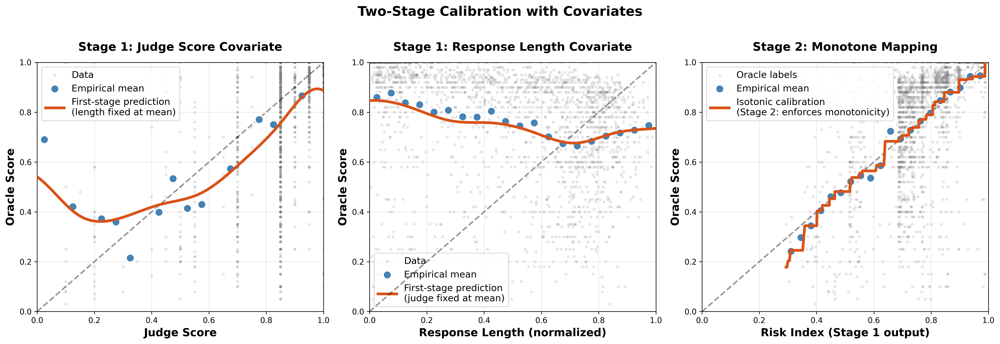

<div align="left">
  
</div>

# CJE - Causal Judge Evaluation

[](https://cimolabs.com/cje)
[](https://www.python.org/downloads/)
[](https://github.com/cimo-labs/cje/actions)
[](LICENSE)

**Turn noisy LLM-judge scores into precise, unbiased estimates of the outcomes you care about.**

CJE calibrates judge scores using a small oracle slice (5-10% coverage), then delivers statistically rigorous estimates.

## How It Works

CJE follows a simple three-step workflow:

```
┌─────────────────────────────────┐
│           Data                  │
│  LLM-judge scores +             │
│  oracle slice (5-50%)           │
└─────────────────────────────────┘
              ↓
┌─────────────────────────────────┐
│         Calibrate               │
│  Learn judge → oracle mapping   │
└─────────────────────────────────┘
              ↓
┌─────────────────────────────────┐
│          Estimate               │
│  Estimates with honest          │
│  uncertainty                    │
└─────────────────────────────────┘
```

**Key benefits:**
- **Small label budget**: 5-10% oracle coverage often sufficient
- **Unbiased estimates**: Judge scores (+ optional covariates) mapped to oracle scale
- **Rigorous inference**: CIs account for both sampling and calibration uncertainty

See [`cje/calibration/README.md`](cje/calibration/README.md#why-isotonic-regression-for-reward-calibration) for technical details.

## 📊 Performance

**[Arena Experiment: 5k Real Evaluations](https://cimolabs.com/blog/arena-experiment)** - Comprehensive benchmarking on ChatBot Arena data:
- **94% pairwise ranking accuracy** with Direct Model + covariates
- **158× ESS improvement** with SIMCal-W vs raw SNIPS
- **Kendall τ = 0.837** vs -0.235 for uncalibrated methods
- Validates AutoCal-R calibration and doubly-robust estimation on real data

## Calibration Methods

CJE provides two calibration modes for mapping judge scores to oracle outcomes (i.e., the KPI you care about):

### Monotone
Standard isotonic regression enforces: *higher judge score → no worse expected outcome*.

**Why isotonic?** It's the right structural prior—assumes only monotonicity (which you actually believe), preserves oracle KPI levels by construction (mean-preserving by KKT conditions), and is highly efficient with small label budgets. See [technical rationale](cje/calibration/README.md#why-isotonic-regression-for-reward-calibration).

Simple, stable, works well when the judge-oracle relationship is already monotone.

### Two-Stage (Default with Covariates)
Learns smooth transformation g(S, X) → rank → isotonic. Handles non-monotone patterns and incorporates additional covariates (e.g., response length, domain metadata) while maintaining final monotonicity guarantee.

<div align="center">
  
</div>

<sub>*Two-stage calibration learns flexible relationships between covariates (judge score, response length) and oracle outcomes in Stage 1, then enforces monotonicity via isotonic regression in Stage 2. **Left/Middle:** Partial dependence plots show how each covariate relates to oracle score while holding others at mean values. **Right:** Final monotone mapping from Stage 1 risk index to calibrated oracle score. Full benchmarking results: [Arena Experiment](https://www.cimolabs.com/blog/arena-experiment). Data from [LMSYS Chatbot Arena](https://huggingface.co/datasets/lmsys/chatbot_arena_conversations).*</sub>

**When to use two-stage:**
- **You have covariates** (response length, domain, etc.) → two-stage is default and recommended
- Judge shows non-monotone empirical E[Oracle|Judge] relationship
- Regional miscalibration (monotone works well at low/high but poorly at mid-range)
- Length bias (judge gives different scores to same-quality responses based on length)

**Auto mode:**
- **With covariates:** Two-stage is automatically used (can incorporate additional features)
- **Judge score only:** CJE automatically selects monotone vs two-stage via cross-validation (1-SE rule)

```python
# Default: Judge score only (no covariates, auto-selects monotone/two-stage via CV)
result = analyze_dataset(fresh_draws_dir="responses/")

# Include response_length covariate for two-stage calibration
result = analyze_dataset(
    fresh_draws_dir="responses/",
    include_response_length=True
)

# Add domain as additional covariate (combine with response_length)
result = analyze_dataset(
    fresh_draws_dir="responses/",
    include_response_length=True,
    calibration_covariates=["domain"]
)

# Force a specific mode
result = analyze_dataset(
    fresh_draws_dir="responses/",
    calibration_mode="monotone"  # or "two_stage"
)
```

## Installation

```bash
pip install cje-eval
```

## 🚀 Try it Now - Interactive Demo

[](https://colab.research.google.com/github/cimo-labs/cje/blob/main/examples/cje_arena_demo.ipynb)

## Quick Start

### Minimal Example

```python
from cje import analyze_dataset

# Compare policies on an eval set
result = analyze_dataset(fresh_draws_dir="responses/")

# Get estimates with confidence intervals
for policy, est, se in zip(
    result.metadata["target_policies"],
    result.estimates,
    result.standard_errors
):
    print(f"{policy}: {est:.3f} ± {1.96*se:.3f}")
```

### Data Format

**Directory structure:** One JSONL file per policy
```
responses/
├── model_a_responses.jsonl
└── model_b_responses.jsonl
```

**Minimal record** (inside each file):
```json
{"prompt_id": "eval_0", "judge_score": 0.85}
{"prompt_id": "eval_1", "judge_score": 0.72}
```

**With calibration** (add oracle labels to 5-10% of samples):
```json
{"prompt_id": "eval_0", "judge_score": 0.85, "oracle_label": 0.86}
{"prompt_id": "eval_1", "judge_score": 0.72}
```

CJE automatically:
- Discovers policies from filenames (`model_a_responses.jsonl` → policy `"model_a"`)
- Applies AutoCal-R when oracle labels are present
- Uses cluster-robust SEs for paired comparisons (when same prompts across policies)
- Returns unbiased estimates with valid 95% CIs

### Paired Comparisons

When comparing policies on the **same prompts** (paired design), CJE automatically uses cluster-robust standard errors:

```python
# Both files must have matching prompt_ids for pairing
result = analyze_dataset(fresh_draws_dir="responses/")

# CJE automatically clusters by prompt for valid inference
if result.metadata.get("prompts_aligned"):
    print("✓ Paired comparison - using cluster-robust SEs")
```

**Why it matters:** Paired designs have correlated outcomes across policies (same prompt evaluated by multiple models). Standard SEs would understate uncertainty. CJE automatically accounts for this by clustering by `prompt_id`.

## Beyond Direct Mode

CJE also supports **IPS** (counterfactual inference from logs) and **DR** (doubly robust with fresh draws). These require log probabilities from your models.

```python
# IPS: Estimate "what if we deployed policy X?" from existing logs
result = analyze_dataset(logged_data_path="logs.jsonl")

# DR: Combine logged data + fresh draws for maximum accuracy
result = analyze_dataset(
    logged_data_path="logs.jsonl",
    fresh_draws_dir="responses/"
)
```

**For IPS/DR data formats and API details:** Run `help(analyze_dataset)` or see [`cje/interface/`](cje/interface/) module docs.

## Visualization

CJE provides diagnostic plots for understanding and validating results:

```python
from cje import analyze_dataset, plot_policy_estimates

# Run analysis
result = analyze_dataset(fresh_draws_dir="responses/")

# Quick plot with convenience method
result.plot_estimates(save_path="estimates.png")

# Or use visualization functions directly for more control
plot_policy_estimates(
    estimates={"policy_a": 0.75, "policy_b": 0.68},
    standard_errors={"policy_a": 0.02, "policy_b": 0.03},
    oracle_values={"policy_a": 0.74, "policy_b": 0.69}  # Optional
)
```

**Available visualizations:**
- `plot_policy_estimates` - Forest plots with confidence intervals
- `plot_calibration_comparison` - Judge→oracle calibration curves
- `plot_weight_dashboard_summary` - Weight diagnostics for IPS/DR
- `plot_weight_dashboard_detailed` - Per-policy weight analysis
- `plot_dr_dashboard` - Doubly robust diagnostics

**Jupyter notebooks:** Results automatically display as formatted tables when evaluated in a cell.

See [`cje/visualization/README.md`](cje/visualization/README.md) for complete guide.

## Documentation

📚 **Getting Started**
- [Interactive Demo](https://colab.research.google.com/github/cimo-labs/cje/blob/main/examples/cje_arena_demo.ipynb) - Try in your browser
- [Examples](examples/) - Working code samples

🔧 **For Engineers**
- [Calibration Methods](cje/calibration/README.md) - AutoCal-R, isotonic regression, two-stage fallback
- [Diagnostics System](cje/diagnostics/README.md) - Uncertainty quantification, OUA, transportability tests
- [Estimators](cje/estimators/README.md) - Direct, IPS, DR implementations
- [Interface/API](cje/interface/README.md) - `analyze_dataset` implementation and mode selection


## Development

```bash
git clone https://github.com/cimo-labs/cje.git
cd cje
poetry install
make test
```

## Support

- 🐛 [Issues](https://github.com/cimo-labs/cje/issues)
- 💬 [Discussions](https://github.com/cimo-labs/cje/discussions)

## License

MIT - See [LICENSE](LICENSE) for details.
