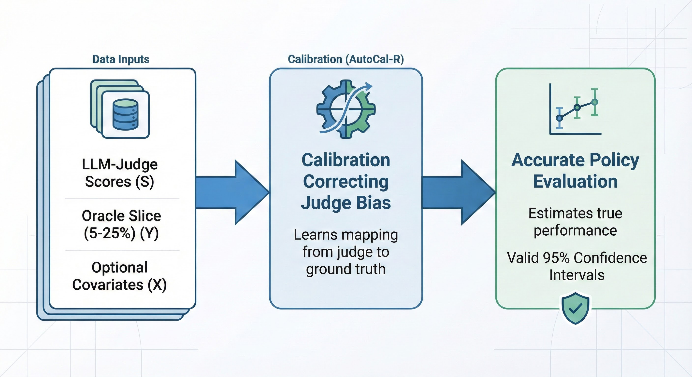
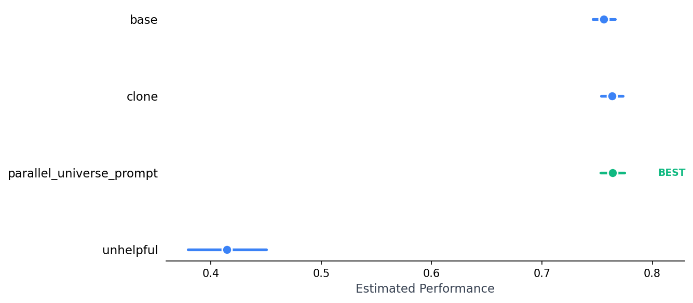
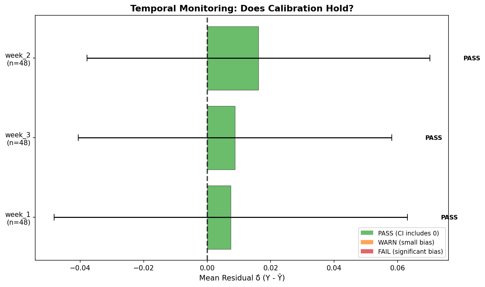
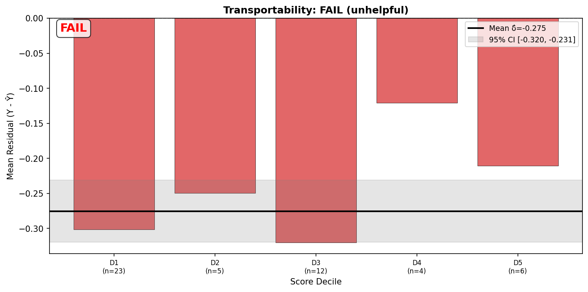

<div align="left">
  
</div>

# CJE - Causal Judge Evaluation

**Stop guessing. Start measuring.**

[](https://cimolabs.com/cje)
[](https://www.python.org/downloads/)
[](https://github.com/cimo-labs/cje/actions)
[](LICENSE)
[](https://pepy.tech/projects/cje-eval)

**Turn noisy, biased LLM-judge scores into precise, unbiased estimates of the outcomes you actually care about.**

---

## The Problem: Your Judge Is Lying

You are likely using an LLM (like GPT-4o) to judge your system's outputs. You take the average score and call it "quality."

**This is statistically invalid.**

Raw judge scores are **surrogates (S)**, not **outcomes (Y)**. They suffer from:

1. **Preference Inversion:** A higher judge score often predicts *lower* real-world quality (due to verbosity bias or sycophancy).
2. **Invalid Confidence Intervals:** Standard error bars assume the judge is perfect. In reality, uncalibrated judges yield **0% coverage**—your "95% confidence interval" almost never captures the truth.
3. **Scale Arbitrariness:** Is a "4.2" actually 5% better than a "4.0"? Or is it just noise?

## The Solution: Calibration via AutoCal-R

CJE fixes this by treating the judge as a **programmable sensor** that must be calibrated.

<div align="center">
  
</div>

**Key benefits:**

- **Small label budget**: 5-25% oracle coverage is often sufficient.
- **Unbiased estimates**: Judge scores (+ optional covariates) mapped to the oracle scale.
- **Rigorous inference**: Confidence Intervals (CIs) account for both sampling error *and* calibration uncertainty (via OUA Jackknife).

---

## 📊 The Proof: The Arena Experiment

*Does this actually work?*

We benchmarked 14 estimators on **5,000 real user prompts** from Chatbot Arena, using GPT-5 as the oracle.

<div align="center">
  
</div>

### The Failure of Standard Methods

- **Raw Judges (Naive):** **0% CI coverage**. The error bars were mathematical lies.
- **Standard IPS:** Failed to rank policies better than random chance due to poor overlap.

### The CJE Result

- **94% Ranking Accuracy** against GPT-5 ground truth: Direct Method + Two-Stage Calibration correctly ranked subtle policy differences.
- **Valid 95% CIs:** Our intervals captured the true GPT-5 score **95% of the time**.
- **16x Cost Reduction:** Achieved GPT-5 level accuracy using GPT-4-nano judges + a small GPT-5 slice.

[**Read the full Arena Experiment Report**](https://cimolabs.com/blog/arena-experiment)

---

## 🚀 Quick Start

```bash
pip install cje-eval
```

## The Workflow

CJE is a loop: **Calibrate → Estimate → Test Transportability → Inspect Residuals → Iterate**

### 1. Calibrate Cheap Scores to Expensive Labels

Your cheap judge (S) needs calibration against expensive oracle labels (Y). CJE learns the S→Y mapping automatically.

```python
from cje import analyze_dataset

# Point to directory with {policy}_responses.jsonl files
# Each file has judge_score for all samples, oracle_label for 5-25%
results = analyze_dataset(fresh_draws_dir="data/responses/")
```

**Data format** (one JSONL file per policy):
```json
{"prompt_id": "1", "judge_score": 0.85, "oracle_label": 0.9}
{"prompt_id": "2", "judge_score": 0.72}
```

### 2. Get Estimates with Valid Uncertainty

CJE provides confidence intervals that account for both sampling error AND calibration uncertainty:

```python
for policy, est, se in zip(
    results.metadata["target_policies"],
    results.estimates,
    results.standard_errors
):
    print(f"{policy}: {est:.3f} ± {1.96*se:.3f}")

# Forest plot for comparison
results.plot_estimates(save_path="ranking.png")
```

### 3. Test Transportability

Before trusting calibration on a new policy, verify it transfers with a small probe (50 oracle labels):

```python
import json
from sklearn.isotonic import IsotonicRegression
from cje.diagnostics import audit_transportability

# Train calibrator on base policy (or extract from results.calibrator if available)
base = [json.loads(l) for l in open("data/responses/base_responses.jsonl")]
base_oracle = [r for r in base if r.get("oracle_label")]
calibrator = IsotonicRegression(out_of_bounds="clip")
calibrator.fit([r["judge_score"] for r in base_oracle], [r["oracle_label"] for r in base_oracle])

# Test on new policy with 50 probe samples
probe = [json.loads(l) for l in open("new_policy_probe.jsonl")]
diag = audit_transportability(calibrator, probe, group_label="policy:new")
print(diag.summary())
# Transport: PASS | N=50 | δ̂: +0.012 (CI: [-0.03, +0.05])

diag.plot()  # Visualize decile-level residuals
```

<div align="center">
  
</div>

<sub>*Transportability audit on Arena data. Clone and parallel_universe_prompt **PASS** (CI includes 0). The adversarial "unhelpful" policy **FAILS** — the calibrator systematically overestimates its quality by 0.28 points.*</sub>

### 4. Inspect Residuals and Iterate

When transportability fails, inspect WHY the judge is being fooled:

```python
import pandas as pd

# Compute residuals for probe samples
probe_df = pd.DataFrame(probe)
probe_df["calibrated"] = calibrator.predict(probe_df["judge_score"])
probe_df["residual"] = probe_df["oracle_label"] - probe_df["calibrated"]

# Find samples where calibrator overestimates quality (negative residual)
worst = probe_df.nsmallest(5, "residual")
for _, row in worst.iterrows():
    print(f"Judge: {row['judge_score']:.2f} → Calibrated: {row['calibrated']:.2f} → Oracle: {row['oracle_label']:.2f}")
    print(f"Response: {row['response'][:200]}...\n")
```

**Common failure patterns:**
- **Length bias** → add `include_response_length=True` to `analyze_dataset()`
- **Domain shift** → collect domain-specific oracle labels and refit
- **Confident nonsense** → improve judge prompt to catch semantic failures

<div align="center">
  
</div>

<sub>*Decile-level residuals for the "unhelpful" policy. Every decile shows negative residuals (overestimation). The judge gives high scores to confident-sounding nonsense; the oracle sees through it.*</sub>

### 5. Tutorials

- [**Core Demo**](https://colab.research.google.com/github/cimo-labs/cje/blob/main/examples/cje_core_demo.ipynb): Full workflow from first principles + library usage
- [**Advanced (IPS/DR)**](https://colab.research.google.com/github/cimo-labs/cje/blob/main/examples/cje_advanced.ipynb): Off-policy evaluation with logged data

---

## Evaluation Modes

CJE automatically selects the most rigorous estimator based on your data.

| Mode | Data Required | Use Case | Why use it? |
|:-----|:--------------|:---------|:------------|
| **Direct** | Fresh responses | **A/B Testing** | **Most Robust.** No complex math. Just compares Policy A vs B on the same prompts. |
| **IPS** | Logs + Logprobs | **Historical Analysis** | **Fastest.** Re-weighs old logs to estimate new policy value without running inference. |
| **DR** | Logs + Fresh | **Production Deploy** | **Most Accurate.** Doubly Robust. Combines logs and fresh draws for minimum variance. |

---

## Under the Hood: Calibration Methods

CJE provides two calibration modes for mapping judge scores (S) to oracle outcomes (Y):

### 1. Monotone (Isotonic Regression)

Standard isotonic regression enforces: *higher judge score → no worse expected outcome*.

- **Why:** It assumes only monotonicity (which you actually believe), preserves oracle KPI levels by construction, and is highly efficient with small label budgets.

### 2. Two-Stage (Default with Covariates)

Learns a smooth transformation g(S, X) → rank → isotonic.

- **Why:** Handles non-monotone patterns and incorporates additional covariates (e.g., **Response Length**) to fix judge biases (like favoring verbosity).

<div align="center">
  
</div>

<sub>*Two-stage calibration corrects for length bias. **Left/Middle:** Partial dependence plots show how the judge rewards verbosity even when quality plateaus. **Right:** Final monotone mapping corrects this bias.*</sub>

---

## Documentation

🔧 **Technical Guides**

- [Calibration Methods](cje/calibration/README.md) - AutoCal-R, isotonic regression, two-stage fallback
- [Diagnostics System](cje/diagnostics/README.md) - Uncertainty quantification, OUA, transportability tests
- [Estimators](cje/estimators/README.md) - Direct, IPS, DR implementations
- [Interface/API](cje/interface/README.md) - `analyze_dataset` implementation

📚 **Examples & Data**

- [Examples Folder](examples/) - Working code samples
- [Arena Sample Data](examples/arena_sample/README.md) - Real-world test data

## Development

```bash
git clone https://github.com/cimo-labs/cje.git
cd cje
poetry install
make test
```

## Support

- 🐛 [Issues](https://github.com/cimo-labs/cje/issues)
- 💬 [Discussions](https://github.com/cimo-labs/cje/discussions)

## License

MIT - See [LICENSE](LICENSE) for details.
