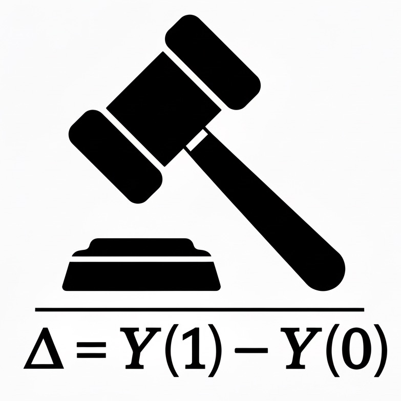
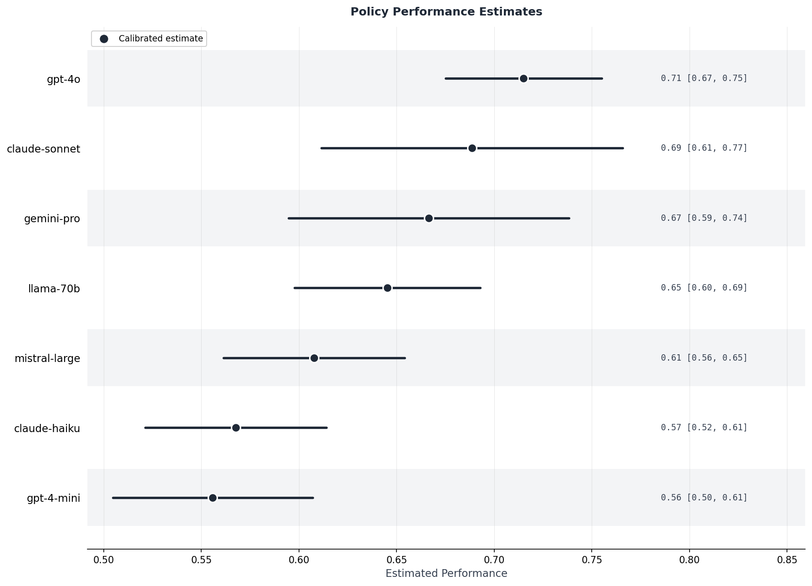

<div align="left">
  
</div>

# CJE - Causal Judge Evaluation

**Your LLM judge scores are noisy and weakly calibrated. CJE calibrates them to what actually matters.**

[](https://arxiv.org/abs/2512.11150)
[](https://huggingface.co/datasets/elandy/cje-chatbot-arena)
[](https://colab.research.google.com/github/cimo-labs/cje/blob/main/examples/cje_core_demo.ipynb)
[](https://cimolabs.com/cje)
[](https://www.python.org/downloads/)
[](https://github.com/cimo-labs/cje/actions)
[](LICENSE)
[](https://pepy.tech/projects/cje-eval)

---

## Quick Start

```bash
pip install cje-eval
```

```python
from cje import analyze_dataset

results = analyze_dataset(
    fresh_draws_data={
        "gpt-4o": [
            {"prompt_id": "eval_001", "judge_score": 0.85, "oracle_label": 0.9},
            {"prompt_id": "eval_002", "judge_score": 0.72, "oracle_label": 0.7},
            {"prompt_id": "eval_003", "judge_score": 0.68},
            {"prompt_id": "eval_004", "judge_score": 0.79},
        ],
        "claude-sonnet": [
            {"prompt_id": "eval_001", "judge_score": 0.78, "oracle_label": 0.82},
            {"prompt_id": "eval_002", "judge_score": 0.81, "oracle_label": 0.79},
            {"prompt_id": "eval_003", "judge_score": 0.75},
            {"prompt_id": "eval_004", "judge_score": 0.83},
        ],
    }
)

results.plot_estimates(save_path="ranking.png")  # requires pip install "cje-eval[viz]"
```

CJE learns the judge→oracle mapping from labeled samples and applies it everywhere. Label 5–25% of samples with your oracle (human raters, strong model, downstream metric). Any bounded scale works automatically (0–1, 0–100, Likert 1–5).

---

## Real-World Validation

We ran CJE on 29,511 physician-labeled HealthBench records with two LLM judges. Both judges were overconfident — by 24.5 pp and 13.0 pp respectively — and disagreed with each other by up to 73 percentage points on specific criteria categories. After calibration with just 5% oracle labels (~1,400 records), both converged to the physician ground truth.

**[Read the full HealthBench audit →](https://cimolabs.com/blog/healthbench-judge-audit)**

<div align="center">
  
  <br><em>Example output: calibrated estimates with valid confidence intervals</em>
</div>

---

## Documentation

| Resource | Description |
|----------|-------------|
| **[Interactive Tutorial](https://colab.research.google.com/github/cimo-labs/cje/blob/main/examples/cje_core_demo.ipynb)** | Walk through a complete example in Colab — no setup required |
| **[CJE in 3 Minutes](https://youtu.be/VbSYrby8iaQ)** | Video: why raw judge scores mislead and how CJE fixes it |
| **[Technical Walkthrough](https://youtu.be/r0dinGsPuqY)** | Video: calibration, evaluation, and transport auditing pipeline |
| **[Operational Playbook](PLAYBOOK.md)** | End-to-end runbook: audits, drift correction, label budgeting |
| **[Planning Notebook](https://colab.research.google.com/github/cimo-labs/cje/blob/main/examples/cje_planning.ipynb)** | Optimize your evaluation budget with pilot data |
| **[Full Docs](https://cimolabs.com/cje)** | Installation, assumptions, API reference, research notes |

**Bridges:** Already running evals in [Promptfoo, TruLens, LangSmith, OpenCompass, or Inspect AI](scripts/cje_bridges/README.md)? Convert those outputs into CJE format with one command.

**Technical deep dives:** [Calibration methods](cje/calibration/README.md) · [Diagnostics](cje/diagnostics/README.md) · [Estimators](cje/estimators/README.md) · [Interface/API](cje/interface/README.md) · [Experiments](experiments/README.md)

---

## Development

```bash
git clone https://github.com/cimo-labs/cje.git
cd cje && poetry install && make test
```

## Citation

If you use CJE in your research, please cite:

```bibtex
@misc{landesberg2025causaljudgeevaluationcalibrated,
  title={Causal Judge Evaluation: Calibrated Surrogate Metrics for LLM Systems},
  author={Eddie Landesberg},
  year={2025},
  eprint={2512.11150},
  archivePrefix={arXiv},
  primaryClass={stat.ME},
  url={https://arxiv.org/abs/2512.11150},
}
```

## License

MIT — See [LICENSE](LICENSE) for details.
